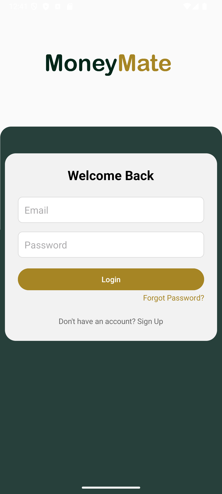
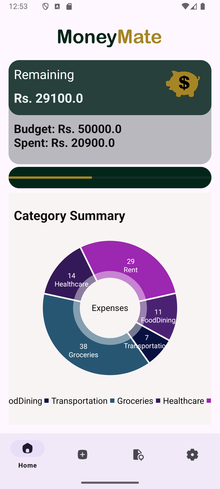
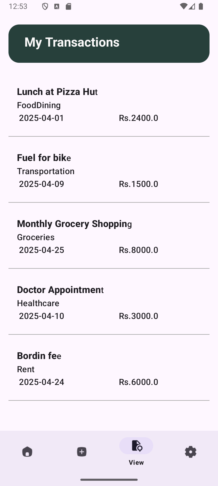

# Finance Tracker App 📱

An Android app built using Kotlin to track income and expenses.

## Features
- Add transactions
- Edit & delete transactions
- Date picker
- Category management

## Screenshots
### Home Screen

### Add Transaction
{width=300}

### View/Edit Transaction
{width=300}

### View/Edit Transaction
{width=300}

## Tech Stack
- Kotlin
- Android Studio
- SharedPreferences

## Author
Ravindu
